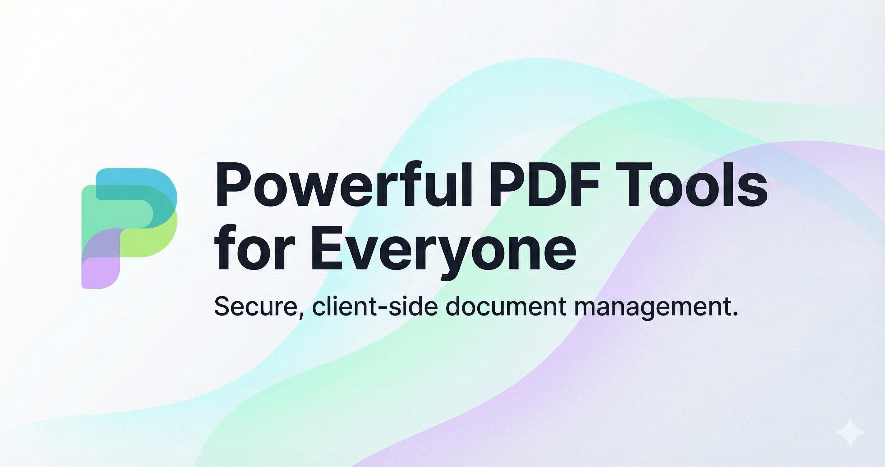

# PDF Utils



A powerful, secure, and entirely client-side PDF management tool built with modern web technologies. Manage your documents without ever uploading them to a server.

**Live Application**: [https://pdfutils.netlify.app/](https://pdfutils.netlify.app/)

## Features

- **Merge PDFs**: Combine multiple PDF files into a single document with ease.
- **Split PDF**: Extract specific ranges or split a document into multiple parts instantly.
- **PDF Organizer**: Group pages, reorder them, and extract custom selections.
- **100% Private**: All processing happens locally in your browser using high-performance JavaScript. Your files never leave your computer.
- **Modern UI**: Polished interface with dark mode support, drag-and-drop functionality, and real-time previews.

## Tech Stack

- **Framework**: [React 19](https://react.dev/)
- **Build Tool**: [Vite](https://vitejs.dev/)
- **Styling**: [Tailwind CSS v4](https://tailwindcss.com/)
- **Components**: [shadcn/ui](https://ui.shadcn.com/)
- **PDF Engine**: [pdf-lib](https://pdf-lib.js.org/) & [pdfjs-dist](https://mozilla.github.io/pdf.js/) (Canvas-based rendering)
- **Runtime & Package Manager**: [Bun](https://bun.sh/)

## Getting Started

### Prerequisites

Ensure you have [Bun](https://bun.sh/) installed on your machine.

### Installation

1. Clone the repository:

   ```bash
   git clone https://github.com/patryksztuczka/pdf-utils.git
   cd pdf-utils
   ```

2. Install dependencies:

   ```bash
   bun install
   ```

3. Start the development server:
   ```bash
   bun run dev
   ```

### Scripts

- `bun run dev`: Starts the development server.
- `bun run build`: Builds the application for production.
- `bun run lint`: Runs ESLint for code quality checks.
- `bun run typecheck`: Runs TypeScript compiler for type integrity.

## Privacy & Security

PDF Util is designed with privacy as a core principle. By leveraging `pdf-lib` and `pdf.js` directly in the browser, we eliminate the need for server-side processing. This means:

- No data is uploaded to any server.
- No risk of document interception during transit.
- Works offline once the page is loaded.

## License

This project is licensed under the MIT License.
